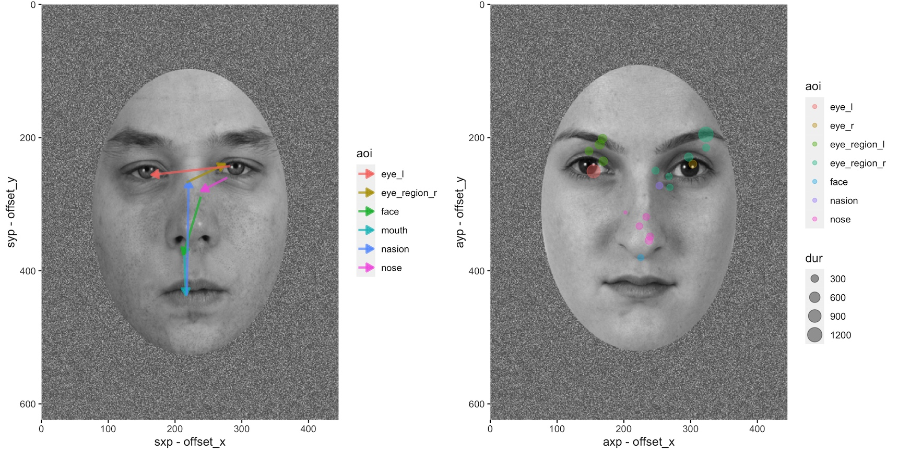

# IDFR_Pipeline

This repository contains the analysis pipeline code for two experiments exploring facial processing and eye tracking (`IDFR_original` and `IDFR_identity`). This pipeline does three main things:

1. Automatically identifies and extracts facial landmarks and face ovals for all face stimuli in the study using mediapipe and OpenCV.
2. Imports and cleans up the raw task and eye tracking data for analysis.
3. Generates area-of-interest (AOI) polygons from the x/y coordinates of the landmarks on the detected faces and identifies which facial AOI(s) each fixation and saccade land on.



## Prerequisites

To run this pipeline, you must have a recent version of R (4.0 or newer). To install all of the prerequisite R pacakages for the pipeline, run the following in a new R session:

```r
install.packages(c("tidyverse", "eyelinker", "sf")) # For the basic pipeline
install.packages(c("bmp", "ggforce", "ggpubr")) # For plots and visualizations
```

The prerequisites and instructions for the data preprocessing scripts (face landmark detection and initial data cleaning) are listed in the `_Preprocessing` folder's README.md.


## Running the pipeline

To set up the pipeline, first download or `git clone` this repository, and then place the required data in the following folders:
	- Task data (`idfr_` folders) should be placed in `_Data/`
	- Face landmark data (`facedata.csv`) should be placed in `_Data/`
	- Face image files should be placed in `_Preprocessing/faces/_images`

Note that only the task data from one IDFR experiment should be placed in `_Data/` at a time: `IDFR_identity` and `IDFR_original` should be each be processed with their own separate copy of the pipeline. The face images and face landmark data are identical between IDFR experiments.

Then, to actually run the pipeline:

1. Open a new R session and set the current working directory (with `setwd()`) to the root of the pipeline (i.e. the folder containing this file).
2. Run `source("./_Scripts/1_preprocessing.R")` to import, clean, and align all data. This may take a while, especially on the first run when all EyeLink data needs to be imported into R (this is cached for future runs in an `eyedata.Rds` file).
3. Run `source("./_Scripts/2_write_preprocessed.R")` to write out the cleaned task data, EyeLink metadata, per-participate fixation/saccade data, and AOI area data out to `.csv` files, as well as plot the defined AOI polygons for each unique face over their respective images. All data written by this script will be saved to the `output` folder in the root of the pipeline, which will be created when this script is run.


## Pipeline outputs

The generated output files can be found in the `output` directory in the root of the pipeline. The output folder will be created when the pipeline is first run. The outputs in this folder include:

### output/task/

This subfolder contains the cleaned trial-by-trial task data for each phase of the experiment (study, test, and rating), generated from the raw .txt output files from EyeLink Experiment Builder.

- `taskdata_encoding.csv`
- `taskdata_recognition.csv`
- `taskdata_ratings.csv`

### output/eyelink/

- `eyelink_settings.csv`: The EyeLink runtime metadata for each participant. This contains the EyeLink model, sample rate, eye tracked (R or L), and more.
- `recalibration_counts.csv`: The number of EyeLink recalibrations prior to each phase of the study for each participant. A high number of recalibrations may indicate tracker accuracy problems for a given participant.
-  `validation_info.csv`: The validation info for the final calibration prior to each block for each participant. This data contains the average and maximum validation errors in degrees of visual angle (`avg.err` and `max.err`, respectively) and the EyeLink's assessement of the calibration quality ("GOOD", "FAIR", or "POOR"), among other info.

### output/fixations/

This subfolder contains a `.csv` for each participant containing the data for all in-trial fixations recorded during the study. The `dur` column contains the durations (in ms), and the `axp` and `ayp` columns contain their average x/y pixel coordinates (respectively).

The `face_on` column indicates whether a face stimulus was present on screen at the time of the fixation. The `on_` columns at the end of the file indicate which facial AOIs (if any) each given fixation landed within.

### output/saccades/

This subfolder contains a `.csv` for each participant containing the data for all in-trial saccades recorded during the study. The `dur` column contains the durations (in ms), the `sxp` and `syp` columns contain their starting x/y pixel coordinates (respectively), and the `exp` and `eyp` columns contain their ending x/y pixel coordinates.

The `face_on` column indicates whether a face stimulus was present on screen at the time of the saccade. The `start_on_` and `end_on_` columns at the end of the file indicate which facial AOIs (if any) each given saccade started or ended within.

### output/aoi\_areas\_per\_image.csv

This file contains the areas (in units of pixels-squared) of each AOI for each separate face image used in the task.

### output/aoi_images/

This subfolder contains `.png` images for each unique facial image in the study with the defined AOIs colour-coded and overlayed on the face. This is for verifying that the defined AOIs are working as intended across the full dataset.