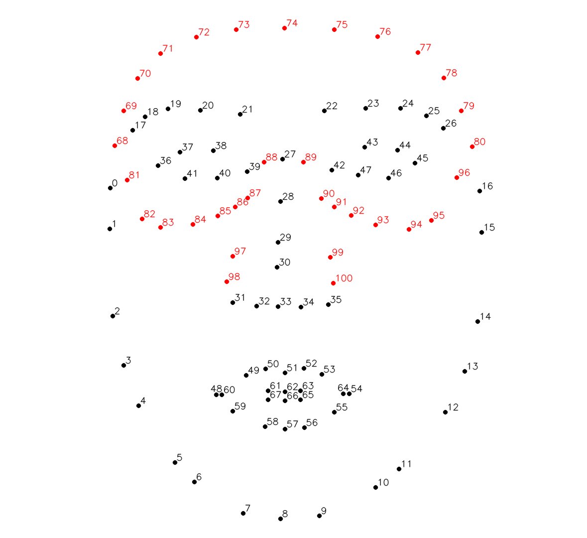
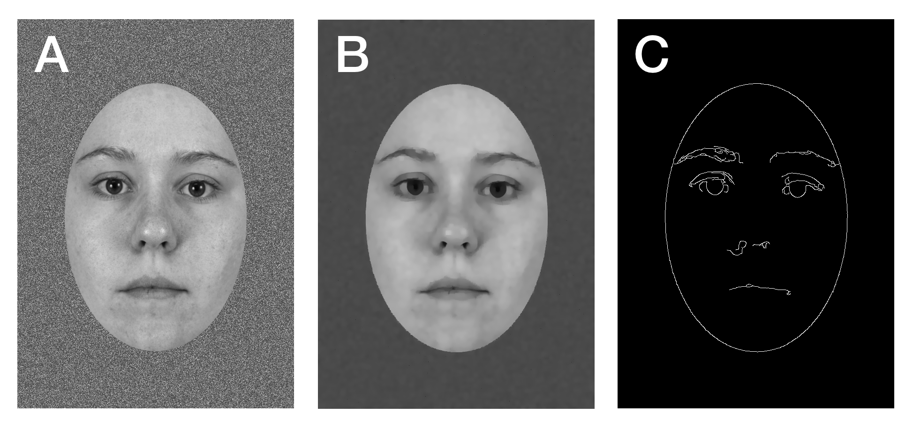

# IDFR Preprocessing Scripts

These scripts are for preparing the data for analysis. You do not need to run them every time you run the pipeline.

## Face Landmark Extraction

This script takes the full set of face stimuli for the study and extracts the pixel coordinates of their facial landmarks, as well as the locations and sizes of their containing ovals.

Facial landmark detection is done using [MediaPipe's Face Mesh](https://google.github.io/mediapipe/solutions/face_mesh.html), which automatically identifies 468 unique landmarks on each face. A subset of those landmarks are then mapped to the [68 landmarks defined by the dlib model](https://www.researchgate.net/figure/The-68-landmarks-detected-by-dlib-library-This-image-was-created-by-Brandon-Amos-of-CMU_fig2_329392737), along with and additional 33 landmarks defining the countours of the forehead, eye regions, and sides of the nose. The indices of all 101 landmarks (0-100) are illustrated below (black = original dlib landmark, red = extension landmark):



The sizes and locations of the ovals containing the faces are extracted using OpenCV by 1) blurring out the white noise in the background, 2) using edge detection to detect all the contours in the image, and 3) finding the height, width and center point of the largest single contour in the image (i.e. the oval):




### Requirements

The landmark extraction scripts require Python 3.8 or newer to run, as well as the OpenCV and MediaPipe Python packages. Once Python has been installed, you can install all the required dependencies by running the following in a terminal:

```
pip install opencv-python mediapipe
```

If running the script on an Apple Silicon Mac, you may need to replace `mediapipe` with `mediapipe-silicon` in the command above.


### Usage

There are two Python scripts for landmark detection and extraction: `view_landmarks.py`, which lets you interactively visualize the detected landmarks and ovals on each face in the `_images` folder, and `extract_landmarks.py`, which extracts the landmarks and ovals for each image and saves them to an output CSV.

To run the landmark viewer script, run `python extract_landmarks.py` within the `faces` folder. A window will open showing the landmarks and oval overlayed over the first face in the image folder. To navigate between images, use the `[` and `]` keys. To toggle between the 101 extracted landmarks and the full 468 landmarks detected by MediaPipe, press the Q key. To exit the viewer, press the Esc key (the viewer may hang if closed using the 'X' button on the window). Additional controls for the viewer are documented in at the top of its Python script.

To run the landmark extraction script, simply run `python extract_landmarks.py` within the `faces` folder. The oval and facial landmark data for each image will be saved to a CSV file (`facedata.csv`) within the same folder. The output CSV will also be automatically copied to the pipeline's `./_Data/` folder for use during analysis.


## Data Cleaning

For the sake of transparency, this script includes the code that used for cleaning and reorganizing the task and EyeLink data prior to analysis. In a nutshell, this script:

1. Ensures the names of all data files match the participant IDs of their parent folders, correcting to match if needed, and
2. Converts the binary EDF EyeLink data files for each participant into plain-text `.asc` files (using the `edf2asc` command-line tool from SR Research) and zip-compresses them to save space.

In order to run this script, a copy of the edf2asc command-line tool must be placed in the same directory as `prepare_data.py` (or be available on your computer's `PATH`). The raw data for the task must also be placed in the `raw` folder.